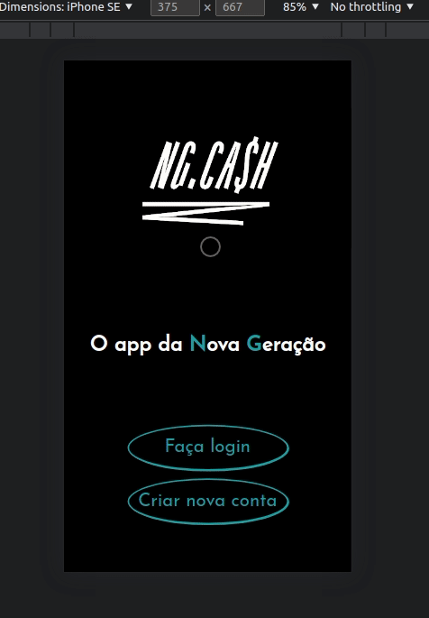

# Desafio NG.CASH

Esta é uma aplicação dockerizada com arquitetura MSC, e desenvolvida tendo em mente as dimensões de um aparelho celular. Para uma melhor experiência, entre em inspecionar e ativo o modo mobile.

## Demo




## Funcionalidades

- Criação de uma conta;
- Login em uma conta;
- Criação de transações financeiras entre usuários;
- Listagem de transações para usuários logados;
- Proteção por autenticação.


## Tech Stack

**Cliente:** React, TypeScript, Context API, CSS3, 

**Servidor:** Node, Express, TypeScript, Prisma ORM, JWT

**Banco de Dados:** PostgreSQL

## Para rodar a aplicação, siga os comandos

Clone o repositório

```bash
  git clone git@github.com:PhilipLages/ng_cash_challenge.git
```

Vá para o diretório do projeto

```bash
  cd ng_cash_challenge
```

Ative os containers docker

```bash
  docker-compose up -d
```
## Backend

Entre no terminal do container backend

```bash
  docker exec -it ng_cash_challenge_backend bash
```
Instale as dependências

```bash
  npm install
```

Crie o banco de dados NgCashDB

```bash
  npm run migration
```

Ative o servidor

```bash
  npm run dev
```

## Frontend

Entre no terminal do container backend

```bash
  docker exec -it ng_cash_challenge_frontend bash
```
Instale as dependências

```bash
  npm install
```
Inicie a aplicação

```bash
  npm run dev
```
Acesse http://localhost:3000

## Back-End: API e Endpoints

#### URL base 

```http
  http://localhost:3001
```

#### Criar uma conta 

```http
  POST /users/signup
```

| Parâmetros | Tipo     |
| :-------- | :------- |
| `username` | `string` |
| `password` | `string` |

#### Fazer login

```http
  POST /users/login
```

| Parâmetros | Tipo     |
| :-------- | :------- |
| `username` | `string` |
| `password` | `string` |

#### Obter a conta de um usuário

```http
  GET /users/:id
```

| Parâmetros | Tipo     |
| :-------- | :------- |
| `id` | `number` |

#### Criar uma transação

```http
  POST /users/:id/transactions
```

| Parâmetros | Tipo     |
| :-------- | :------- |
| `username` | `string` |
| `value` | `number` |
| `id` | `number` |

#### Obter transações de um usuário

```http
  GET /users/:id/transactions
```

| Parâmetros | Tipo     |
| :-------- | :------- |
| `id` | `number` |


